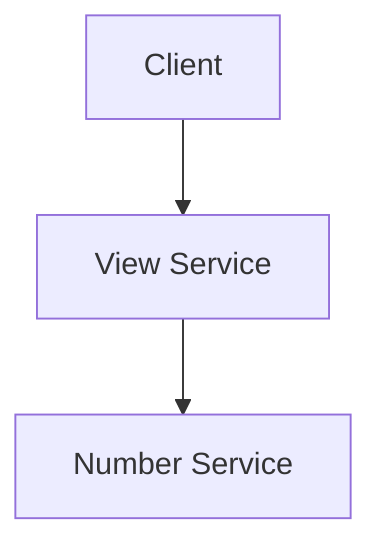

# example-app

A simple microservice app



## API Documentation

In order to generate the API documentation, create a **package.go** in the service's root directory (`main` package). The file should contain the following:

```go
package main

// generate swagger docs
//go:generate swag init --dir ./,../internal --output ./docs --parseInternal --generatedTime
```

Explanation:

The `//go:generate` instruments Go to run a specific command, when `go generate ./...` is executed. This allows us to generate the API documentation with the following command:

```bash
go generate ./...
```

The `swag init` command generates the API documentation. The `--dir` flag specifies the directories to parse for Swagger comments. The `--output` flag specifies the output directory. The `--parseInternal` flag parses internal packages. The `--generatedTime` flag adds a timestamp to the generated files.

### Accessing the API documentation

The API documentation is available at http://localhost:<port>/swagger/index.html when running the app locally. The port is defined in the `.env`/`docker-compose` file depending on your local environment.
